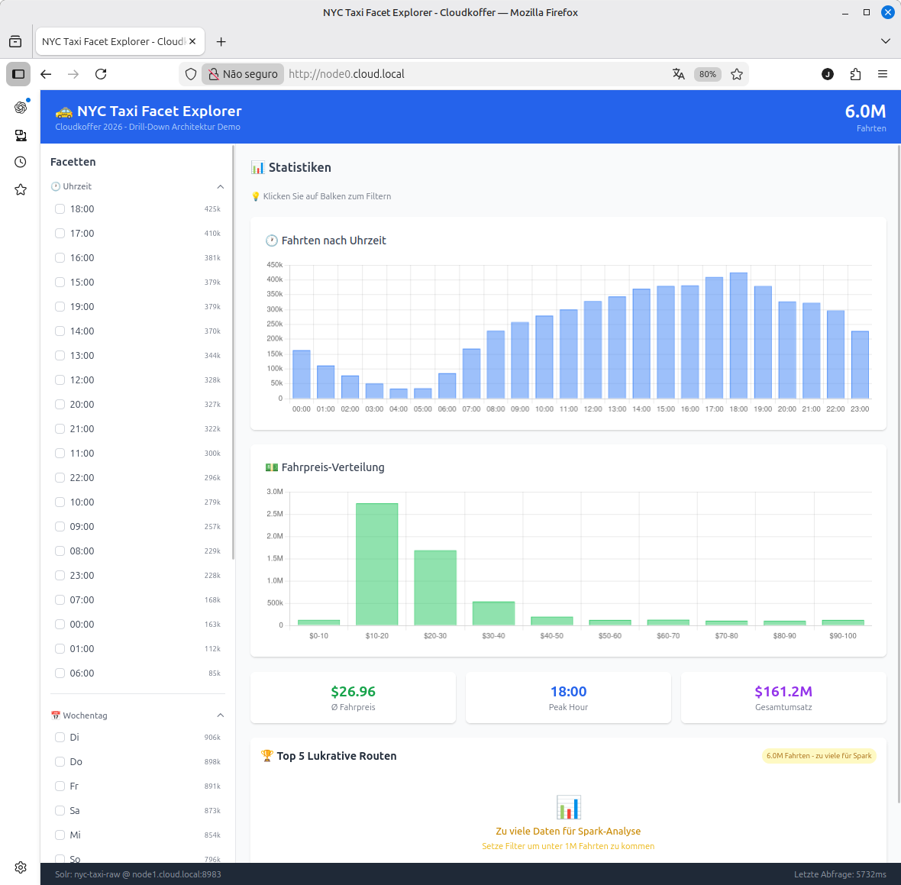
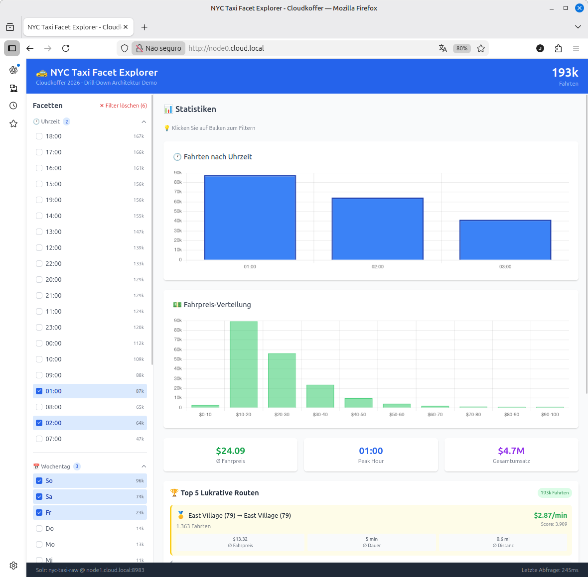

# 🚕 NYC Taxi Explorer

**Finde die lukrativsten Routen in 6 Millionen Taxifahrten – in Sekunden.**

*Vibe Coded 2026 mit der Architektur von 2016.*

---



## Was ist das?

Eine interaktive Web-App, die dich durch **6 Millionen echte New Yorker Taxifahrten** navigieren lässt. Klick dich durch Uhrzeiten, Wochentage, Bezirke und Fahrpreise – und entdecke Muster, die in den Daten versteckt sind.

**Die Kernfrage:** Welche Routen bringen am meisten Geld pro Minute?

## So funktioniert's

### 1. Filtern mit Facetten

Links siehst du Filter für:
- 🕐 **Uhrzeit** – Wann wurde die Fahrt gestartet?
- 📅 **Wochentag** – Montag bis Sonntag
- 💳 **Zahlungsart** – Kreditkarte, Bargeld, ...
- 📍 **Pickup Zone** – Wo wurde eingestiegen?

**Das Besondere:** Du kannst mehrere Werte gleichzeitig auswählen. Filter nach "18 Uhr ODER 19 Uhr" – und sieh sofort, wie sich die anderen Kategorien verändern.

### 2. Drill-Down durch Charts

Die Balkendiagramme sind klickbar! 

Siehst du einen interessanten Peak um 18 Uhr? Klick drauf. 
Fahrpreise zwischen $20-30 sind spannend? Klick drauf.

Jeder Klick verfeinert die Auswahl – von 6 Millionen auf die Fahrten, die dich interessieren.

---

## Beispiel: Die Montags-Analyse


**Frage:** Wie sieht der typische Montag in NYC aus?

**Ergebnis:** 
- Peak um 18-19 Uhr (Feierabend-Rush)
- Kreditkarte dominiert (70%+)
- Upper East Side ist Hotspot

---

## Beispiel: Wochenend-Party-Routen



**Filter:** Freitag + Samstag, 22-02 Uhr

**Entdeckung:** Ganz andere Routen werden lukrativ! 
Die Nachtclub-Bezirke übernehmen, Flughäfen verschwinden aus den Top-Routen.

---

## Beispiel: Die Premium-Fahrten


**Filter:** Montag + Fahrpreis $20-30

**Erkenntnis:** Längere Strecken, mehr Trinkgeld, andere Pickup-Zonen.

---

## Der Lukrativitäts-Score

Nicht jede Route mit hohem Umsatz ist auch profitabel. Eine Stunde im Stau bringt nichts.

**Unser Score kombiniert:**

```
Score = (Durchschnitts-Fahrpreis × Anzahl Fahrten) ÷ Fahrtdauer
```

| Faktor | Warum wichtig? |
|--------|----------------|
| **Fahrpreis** | Mehr Geld pro Fahrt = besser |
| **Anzahl Fahrten** | Häufige Routen = verlässlich |
| **Fahrtdauer** | Kürzer = mehr Fahrten pro Stunde möglich |

**Das Ergebnis:** Upper East Side ↔ Upper East Side gewinnt fast immer. Kurze Strecken, zahlungskräftige Kunden, schneller Turnaround.

---

## Die Daten

| Metrik | Wert |
|--------|------|
| **Fahrten** | ~6 Millionen |
| **Zeitraum** | Januar + Februar 2023 |
| **Quelle** | NYC Taxi & Limousine Commission |
| **Felder** | Pickup/Dropoff Zone, Zeit, Preis, Distanz, Zahlungsart |

Die Rohdaten sind öffentlich verfügbar – wir haben sie "nur" durchsuchbar und analysierbar gemacht.

---

## Unter der Haube

*(Für die, die es wissen wollen)*

Diese App kombiniert zwei mächtige Technologien:

**Apache Solr** für blitzschnelle Facetten
→ Jeder Klick löst eine Abfrage auf 6M Dokumente aus
→ Antwort in unter 50 Millisekunden

**Apache Spark** für die Route-Analyse
→ Lädt Daten parallel von 4 Servern
→ Berechnet den Score über Millionen von Fahrten

Das Geheimnis: **Solr navigiert, Spark analysiert.** 
Du filterst dich durch bis zur interessanten Teilmenge – und dann rechnet Spark.

---

## Lust auf mehr?

Die komplette Architektur ist dokumentiert:

- [Drill-Down Architecture](docs/ARTICLE-drill-down-architecture.md) – Der tiefe Einblick
- [Webapp Technical README](webapp/README.md) – Frontend + Backend Details
- [Cluster Setup](docs/README-BAREMETAL-SETUP.md) – Die Hardware dahinter

**Fun Fact:** Diese Architektur haben wir 2016 zum ersten Mal gebaut. 
10 Jahre später funktioniert sie immer noch besser als die meisten "modernen" Alternativen.

---

*Built with ☕ und viel zu vielen Taxidaten.*
