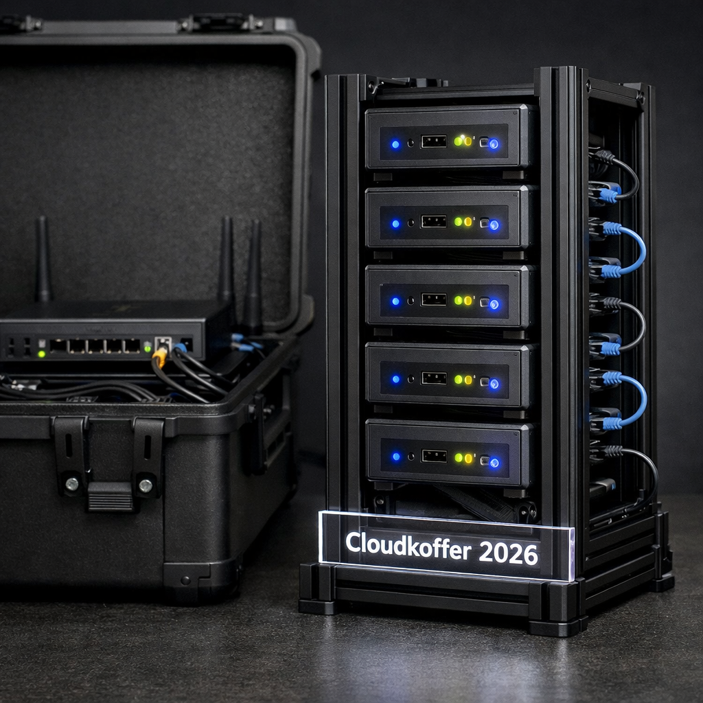

# Cloudkoffer 2026

Ein portabler Cluster auf 5 Intel NUCs mit austauschbaren Showcases fuer Demos, Workshops und Entwicklung.



```
 CLOUDKOFFER 2026

   +----------+ +----------+ +----------+ +----------+ +----------+
   |  node0   | |  node1   | |  node2   | |  node3   | |  node4   |
   | 32GB RAM | | 32GB RAM | | 32GB RAM | | 32GB RAM | | 32GB RAM |
   |  4 Cores | |  4 Cores | |  4 Cores | |  4 Cores | |  4 Cores |
   +-----+----+ +-----+----+ +-----+----+ +-----+----+ +-----+----+
         |            |            |            |            |
         +------------+------------+------------+------------+
                              Gigabit Switch
                                   |
                          +--------+--------+
                          |   EdgeRouter X  |--- Internet
                          +-----------------+
```

---

## Architektur: Drei Phasen

```
Phase 1: Infrastruktur       Phase 2: Basis              Phase 3: Showcase
 (einmalig)                   (einmalig)                  (austauschbar)

 +------------------+         +------------------+        +------------------+
 | Bare Metal / VMs |  --->   | OS-Tuning, DNS   |  --->  | Solr+Spark+Taxi  |
 | Ubuntu 24.04     |         | Java, SSH        |        | ODER             |
 | Cloud-Init       |         | Prometheus       |        | Cloud-Native K8s |
 | Netzwerk         |         | Grafana          |        | ODER             |
 +------------------+         +------------------+        | Cassandra+Kafka  |
                                                          +------------------+
```

## Verfuegbare Showcases

| Showcase | Beschreibung | Status |
|----------|-------------|--------|
| **[solr-spark-taxi](showcases/solr-spark-taxi/)** | NYC-Taxi Explorer mit Solr, Spark, ZooKeeper, JupyterLab, Vue.js Webapp | Aktiv |
| **[clickhouse-taxi](showcases/clickhouse-taxi/)** | NYC-Taxi Analysis mit ClickHouse OLAP, JupyterLab | Aktiv |
| cloud-native-k8s | Kubernetes auf Bare Metal | Geplant |
| cassandra-spark-kafka | Streaming-Pipeline | Geplant |

---

## Quick Start

```bash
# Phase 2: Basis-Installation
make base ENV=baremetal

# Phase 3: Showcase deployen
make deploy ENV=baremetal SHOWCASE=solr-spark-taxi

# Validieren
make smoke-tests SHOWCASE=solr-spark-taxi

# Showcase wechseln
make switch FROM=solr-spark-taxi TO=cloud-native-k8s
```

## Befehle

```bash
make help                    # Alle Befehle anzeigen
make base                    # Basis installieren
make deploy                  # Showcase deployen
make teardown                # Showcase entfernen
make switch FROM=x TO=y      # Showcase wechseln
make smoke-tests             # Tests ausfuehren
make status                  # Cluster-Status
make ping                    # Nodes anpingen
make shutdown                # Cluster herunterfahren
```

## Projektstruktur

```
cloudkoffer/
  infrastructure/        Bare-Metal Setup (ISO, Cloud-Init, EdgeRouter)
  inventory/             Umgebungs-Inventories (IPs, SSH-Keys)
    baremetal/hosts.yml
    local/hosts.yml      (VMs - Platzhalter)
  roles/                 Wiederverwendbare Ansible-Rollen
  base.yml               Basis-Playbook (OS-Tuning, DNS, Monitoring)
  showcases/             Austauschbare Showcases
    solr-spark-taxi/     NYC-Taxi Explorer
  ansible.cfg            Ansible-Konfiguration
  Makefile               Orchestrierung
```

---

## Lizenz

MIT License - siehe [LICENSE](LICENSE)
